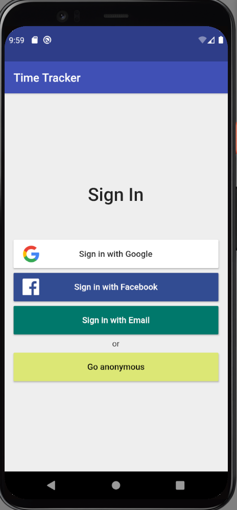
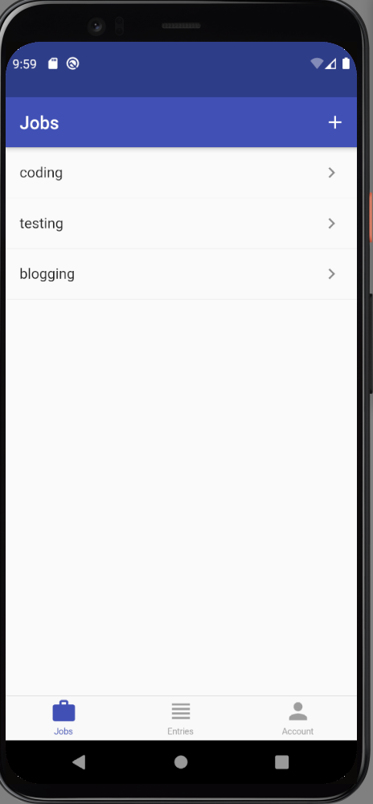
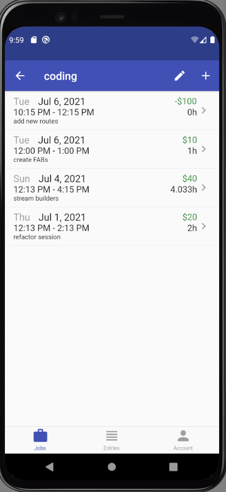
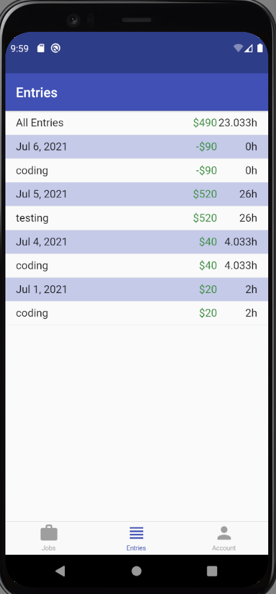

# Time Tracker Application

This application was built whilst taking [Flutter & Firebase](https://courses.codewithandrea.com/) 

The application allows various methods of sign in and Authentication

  
  A page to record jobsand hourly rates

   

 You can then break down the job tasks givving more detail

  

  A bottom navigation bar allows access to all the screens, including a list of all
  job entries

     
